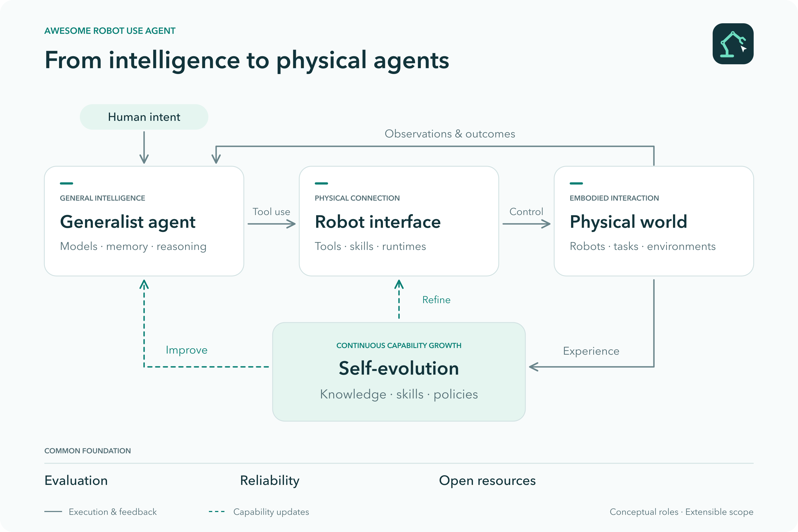

# Awesome-Robot-Use-Agent

  

A curated list of research on general-purpose AI agents that perceive, program, and operate robots through tools, interfaces, and reusable skills.

Inspired by Phillip Isola's [Robot-Use Agents](https://web.mit.edu/phillipi/www/writing/robot-use-agents.html). The emphasis is on how general-purpose intelligence can be connected to different robots and how improvements can spread through models, software interfaces, and reusable capabilities.

  

## Contents

- [General-Purpose Robot-Use Agents](#general-purpose-robot-use-agents)
- [Reasoning-Acting and Dual-System Architectures](#reasoning-acting-and-dual-system-architectures)
- [Self-Evolving Robot Agents](#self-evolving-robot-agents)
- [Embodied Agent Operating Systems and Runtimes](#embodied-agent-operating-systems-and-runtimes)
- [Programming and Spatial Action Interfaces](#programming-and-spatial-action-interfaces)
- [Planning, Skill Orchestration and Memory](#planning-skill-orchestration-and-memory)
  - [Task Planning, Skill Orchestration and Memory](#task-planning-skill-orchestration-and-memory)
  - [Safe Planning, Verification and Failure Recovery](#safe-planning-verification-and-failure-recovery)
  - [Multi-Robot Coordination](#multi-robot-coordination)
- [Language-Native Actions and Cross-Embodiment Transfer](#language-native-actions-and-cross-embodiment-transfer)
- [Infrastructure and Benchmarks](#infrastructure-and-benchmarks)
- [Perspectives and Reports](#perspectives-and-reports)

### General-Purpose Robot-Use Agents

General-purpose models operating robots through reusable harnesses, tools, and visual interfaces.
- AR-WAM: A Visual-Conditioned Agent-Ready World Action Model for Robotic Manipulation — *Agent-ready manipulation through visual grounding, operation tokens, and `detect` / `execute` / `query` interfaces.*
  

- Structured World-State Reasoning for Agentic Robotic Search — *WORLDS maintains a persistent world-state graph and lets agents request, verify, and revise observations before selecting a target.*
  
- Transferring the Intelligence of VLMs to Robotic Control — *RoboDawn*
  
- RoboFind: Multi-Agent Personalized Object Search for People Who Are Blind or Have Low Vision 
  

- Navi-Agent: Unlocalized Monocular Navigation Agent — *Previously reported; coordinate-free spatial memory for closed-loop navigation, progress verification and recovery.*
  

- In-Context Robot Learning with VLM Agents — *GPT-Policy; in-context adaptation without parameter updates.*
  
  
  
  
- WetRobo: A Reproducible Robot Kit for Coding Agents in Biological Laboratories — *Laboratory robotics.*
  
  
  
- HarnessVLN: Unifying Training-Free Embodied Navigation through an Agent Harness — *Navigation.*
  
  
- EMERGE-Policy: A Robot Mind Emerges Beyond a Single Policy
  
  
  
  
- Agent as Policy for Robotic Manipulation
  
  
  
- Show-Harness: Just a VLM Agent Can Play Robots
  
  
  
  
  
  
- VIA: Visual Interface Agent for Robot Control
  
  
  
  
- CaP-X: A Framework for Benchmarking and Improving Coding Agents for Robot Manipulation
  
  
  
  
- Guava: An Effective and Universal Harness for Embodied Manipulation
  
  
- ETA: A New Agentic Paradigm for Embodied Tasks
  
  
  
  
- Maestro: Orchestrating Robotics Modules with Vision-Language Models for Zero-Shot Generalist Robots
  
  

### Reasoning-Acting and Dual-System Architectures

Architectures that organize reasoning and robot execution through intermediate plans, coupled reasoning and action modules, or adaptive think/act scheduling. Includes learned-policy building blocks and agent-level systems. For author-described System 1 (e.g., Jev-like system) /System 2 models (VLM-like models), fixed-rate and asynchronous coupling are distinguished from adaptive reasoning. Related task-time memory and recovery methods remain under [Planning, Skill Orchestration and Memory](#planning-skill-orchestration-and-memory).

- DSWAM: A Dual-System World Action Foundation Model for Fine-Grained Robot Manipulation — *System 1 WAM execution with an optional System 2 subtask planner; video co-training without future-video generation at inference.*
  
  
- Fast-ThinkAct: Efficient Vision-Language-Action Reasoning via Verbalizable Latent Planning — *Preference-guided distillation compresses reasoning into verbalizable latents for action policies; evaluated in simulation and embodied reasoning benchmarks.*
  
  
- ThinkAct: Vision-Language-Action Reasoning via Reinforced Visual Latent Planning — *Action-aligned reinforcement learning connects a vision-language reasoner to a diffusion policy through visual plan latents; simulation evaluation.*
  
  
- Fast-in-Slow: A Dual-System Foundation Model Unifying Fast Manipulation within Slow Reasoning — *Partially shared System 1/System 2 parameters with asynchronous observations and action generation; simulation and real-robot evaluation.*
  
  
  
  
- Agentic Robot: A Brain-Inspired Framework for Vision-Language-Action Models in Embodied Agents — *Planner–executor–verifier coordination with subgoal verification and recovery; evaluated on LIBERO.*
  
  
  
  
- OneTwoVLA: A Unified Vision-Language-Action Model with Adaptive Reasoning — *A unified VLA predicts reasoning or action mode tokens to think at critical moments and otherwise execute action chunks.*
  
  
  
  
- GR00T N1: An Open Foundation Model for Generalist Humanoid Robots — *An Eagle-2 vision-language System 2 conditions a flow-matching System 1 action module, jointly trained across heterogeneous data.*
  
  
  
- Hi Robot: Open-Ended Instruction Following with Hierarchical Vision-Language-Action Models — *A high-level VLM guides a low-level VLA through language; planning refreshes periodically and on user feedback.*
  
  
- Robotic Control via Embodied Chain-of-Thought Reasoning — *ECoT; a VLA reasons about plans, sub-tasks, motion and visually grounded state before predicting robot actions.*
  
  
  
  

### Self-Evolving Robot Agents

Systems that turn experience into reusable knowledge, skill programs, improved policies, or validated capability upgrades. Includes human-guided methods and learned-policy precursors where noted.

#### Memory and Knowledge Evolution
- MessyMem: Learning-from-Doing Memory for Mobile Manipulation
  
  
- Robo-Cortex: A Self-Evolving Embodied Agent via Dual-Grain Cognitive Memory and Autonomous Knowledge Induction
  
  
- Distilling and Retrieving Generalizable Knowledge for Robot Manipulation via Language Corrections
  
  
  
  

#### Skill and Program Evolution
- Learning and Transferring Closed-Loop Robot Software — *Coding-agent optimization and reuse of closed-loop robot programs in simulation.*
  
- Self-Evolving Embodied Agents via Skill-Harness Evolution — *SHAPER; frozen-model skill and harness optimization.*
  
- ASPIRE: Agentic /Skills Discovery for Robotics
  
  
  
  
- Lifelong Robot Library Learning: Bootstrapping Composable and Generalizable Skills for Embodied Control with Language Models
  
  
- Eureka: Human-Level Reward Design via Coding Large Language Models
  
  
  
  
- DrEureka: Language Model Guided Sim-To-Real Transfer
  
  
  
  

#### Autonomous Data Collection and Policy Improvement
- KnowDemo: Knowledge-Guided Robot Demonstration Generation from Human Videos — *VLM-based task-knowledge extraction for generating diverse, validated robot demonstrations.*
  
  
- MAGMA-GEN: Validated Recovery Supervision from Ambiguous Failures via Counterfactual Re-Execution — *Simulation-validated recovery data for fine-tuning tool-using robot language policies.*
  
  
  
- RoboClaw: An Agentic Framework for Scalable Long-Horizon Robotic Tasks
  
  
  
  
- Zero2Skill: Bootstrapping Robot Skills through Autonomous Data Collection, Training, and Deployment
  
  
  
  
- ENPIRE: Agentic Robot Policy Self-Improvement in the Real World — *Coding-agent-driven real-world policy and algorithm improvement.*
  
  
  
  
- HARBOR: A Harness Framework for Agentic Robot Reinforcement Learning
  
  
  
  
- AutoRT: Embodied Foundation Models for Large Scale Orchestration of Robotic Agents
  
  
- Autonomous Improvement of Instruction Following Skills via Foundation Models
  
  
  
  
- RoboCat: A Self-Improving Generalist Agent for Robotic Manipulation
  
  
- RISE: Self-Improving Robot Policy with Compositional World Model
  
  
  
  
- AllDayNav: Lifelong Navigation via Real-World Reinforcement Learning
  
  

#### Capability Upgrades and Regression Control

- Learning Without Losing Identity: Capability Evolution for Embodied Agents
  
  
  
  
- Governed Capability Evolution: Lifecycle-Time Compatibility Checking and Rollback for AI-Component-Based Systems, with Embodied Agents as Case Study
  
  
  
  

Related system-level memory and learning mechanisms: [PhyAgentOS, ABot-Claw, and WCM](#embodied-agent-operating-systems-and-runtimes). Execution-time recovery methods are listed under [Safe Planning, Verification and Failure Recovery](#safe-planning-verification-and-failure-recovery).

### Embodied Agent Operating Systems and Runtimes

Persistent embodied-agent systems that organize robot capabilities, state, resources, execution checks, and feedback across tasks or robots.
- Retriever: Composing the Perception-Reasoning-Action Loop for Long-Horizon Manipulation — *Asynchronous runtime and deterministic replay.*
  
  
  
  
- Harness Robotic OS: A Unified Embodied-Agent Runtime for Closed-Loop Quadruped Inspection
  
- PhyAgentOS: A Self-Evolving Operating System for Embodied Agents with Decoupled Cognitive Planning and Physical Execution
  
  
  
  
- RoboOS: A Hierarchical Embodied Framework for Cross-Embodiment and Multi-Agent Collaboration
  
  
  
  
- ROSClaw: An OpenClaw ROS 2 Framework for Agentic Robot Control and Interaction
  
- ABot-Claw: A Foundation for Persistent, Cooperative, and Self-Evolving Robotic Agents
  
  
  
- AEROS: A Single-Agent Operating Architecture with Embodied Capability Modules
  
  
  
  
- HoloAgent-0: A Unified Embodied Agent Framework with 3D Spatial Memory
  
  
  
  
- EmbodiedSkills: A Unified Framework for Orchestrating, Training, and Deploying VLA Agents
  
  
  
- WCM: World-Cognition Model for Generalizable Human-Robot Interaction
  
- EMOS: Embodiment-aware Heterogeneous Multi-robot Operating System with LLM Agents
  
  
  
  

### Programming and Spatial Action Interfaces

Code, visual prompts, geometric constraints, and other interfaces that connect model reasoning to robot execution.
- ManiSkillFormer: Demonstration-Free Compositional Manipulation via Task-Conditioned Geometric Contracts
  
- AntiGrounding: Executable Robot Trajectories as Visual Prompts for VLM-Guided Manipulation — *VLM selection of executable trajectories through a visual interface and an initialized digital twin.*
  
- Auto-HSI: Personalized human control of a robot swarm on demand by using LLMs for online automatic code generation — *Human-in-the-loop interface.*
  
- KINO: A Keyframe Interface for VLM Planning and Whole-Body Control in Humanoid Loco-Manipulation — *Learned low-level controller.*
  
- AnchorVLN: Geometry-Anchored Vision-Language Grounding Reasoning for Open-Vocabulary Navigation
  
  
  
- GTA-2: A Multi-VLM Framework for Synthesizing Robot Manipulation Skills via Grounded Task Axes
  
  
- Evolve Vision-Language-Action Model into an Agent with On-the-fly Tool-use
  
- Code as Policies: Language Model Programs for Embodied Control
  
  
  
  
- ProgPrompt: Generating Situated Robot Task Plans using Large Language Models
  
  
  
  
- ChatGPT for Robotics: Design Principles and Model Abilities
  
  
  
  
- VoxPoser: Composable 3D Value Maps for Robotic Manipulation with Language Models
  
  
  
  
- ReKep: Spatio-Temporal Reasoning of Relational Keypoint Constraints for Robotic Manipulation
  
  
  
  
- PIVOT: Iterative Visual Prompting Elicits Actionable Knowledge for VLMs
  
  
  
- MOKA: Open-World Robotic Manipulation through Mark-Based Visual Prompting
  
  
  
  
- SoFar: Language-Grounded Orientation Bridges Spatial Reasoning and Object Manipulation
  
  
  
  
  
- LangNav: Language as a Perceptual Representation for Navigation
  
  
  
  
- LM-Nav: Robotic Navigation with Large Pre-Trained Models of Language, Vision, and Action
  
  
  
  
- Language to Rewards for Robotic Skill Synthesis
  
  
  
  
- Trust the PRoC3S: Solving Long-Horizon Robotics Problems with LLMs and Constraint Satisfaction
  
  
  
  

### Planning, Skill Orchestration and Memory

Agents that select and coordinate robot capabilities, track state, verify outcomes, and recover from failures.

#### Task Planning, Skill Orchestration and Memory

Task decomposition, reusable skill orchestration, and task-time memory. Includes learned hierarchical planners and action models where applicable.
Cross-cutting reasoning/action coupling and System 1/System 2 designs are listed under [Reasoning-Acting and Dual-System Architectures](#reasoning-acting-and-dual-system-architectures).

- World Action Planner: Generalizable Decision-Making with Action-Conditioned World Models — *VLM action plans are refined through action-conditioned world-model imagination, optimization and search; simulation evaluation.*
  
  
  
  
- MistyPilot: Enabling Social-Robot Control through Multi-Agent LLM Skill Orchestration — *Natural-language skill orchestration, sensor-event binding, and dialogue-state management on a physical social robot.*
  
  
  
  
- Bridging Thought and Action: Taming Long-Horizon Instability in Open-Source LLM Agents with a MetaTool-Enhanced ROS Framework
  
- 2AM: Grounding Agent-Side Memory as Guidance for Steerable Action Models in Long-Horizon Manipulation
  
- Memory as Plans: World-Action Modeling with Memory-Grounded Planning
  
  
  
  
- Towards Long-horizon Embodied Agents with Tool-Aligned Vision-Language-Action Models
  
- Do As I Can, Not As I Say: Grounding Language in Robotic Affordances
  
  
- SayCanPay: Heuristic Planning with Large Language Models using Learnable Domain Knowledge — *Offline action-sequence search; simulation evaluation.*
  
  
  
  
- Inner Monologue: Embodied Reasoning through Planning with Language Models
  
  
- SayPlan: Grounding Large Language Models using 3D Scene Graphs for Scalable Robot Task Planning
  
  
- RoboStream: Weaving Spatio-Temporal Reasoning with Memory in Vision-Language Models for Robotics
  
  
  
  
- Towards the Harness of Embodied Agents
  
  
  
  
- Harness VLA: Steering Frozen VLAs into Reliable Manipulation Primitives via Memory-Guided Agents
  
  
  
  
- Being-0: A Humanoid Robotic Agent with Vision-Language Models and Modular Skills
  
  
  
  
- MOSAIC: Modular Foundation Models for Assistive and Interactive Cooking
  
  

- Creative Robot Tool Use with Large Language Models — *RoboTool; executable plans over parameterized skills.*
  
  

#### Safe Planning, Verification and Failure Recovery

Methods that assess risks, verify execution, and trigger corrective planning or recovery. Failure-recovery benchmarks are listed under [Infrastructure and Benchmarks](#infrastructure-and-benchmarks).
- FRAMES: Failure Recovery And Monitoring of Embodied Skills for Humanoid Loco-Manipulation — *A planner, VLM monitor, recovery agent, and memory module form a failure-aware supervisory loop for humanoid skills.*
  
- CommitFlow: Semantic Commitment Verification and Local Correction for Long-Horizon Robot Manipulation VLA Execution — *Frozen-policy execution harness with semantic commitment monitoring, local correction and stage-level verification.*
  

- When Should a Failing Robot Ask? Initiating Corrective Human-Robot Dialogue from Audited Sensor Evidence — *Evidence-aware choice between autonomous action, additional sensing and human assistance after failure.*
  

- Coding Agents with an Obstacle-Aware Harness for Safe Robot Manipulation — *SafeHarness; obstacle-aware route verification, replanning, and contact execution, evaluated in simulation.*
  
- GAVEL: Graph World Models for Verified and Efficient Long-Horizon LLM Task Planning 
  
- Safe Task Planning with Long-Term Graph Memory for Embodied Agents
  
  
  
  
- VLA-Corrector: Stage-Aware Observable State Understanding for Prompt-Based Closed-Loop Recovery of Vision-Language-Action Policies
  
- CoPAL: Corrective Planning of Robot Actions with Large Language Models
  
  
  
  
- REFLECT: Summarizing Robot Experiences for Failure Explanation and Correction
  
  
  
  
- DoReMi: Grounding Language Model by Detecting and Recovering from Plan-Execution Misalignment
  
  
- AHA: A Vision-Language-Model for Detecting and Reasoning Over Failures in Robotic Manipulation
  
  
  
  

- Robots That Ask For Help: Uncertainty Alignment for Large Language Model Planners — *KnowNo; calibrated uncertainty and human clarification.*
  
  
  

#### Multi-Robot Coordination

Task allocation, communication, and organizational structures for teams of robots or embodied agents. ORCH is evaluated in simulation; system-level runtimes are listed under [Embodied Agent Operating Systems and Runtimes](#embodied-agent-operating-systems-and-runtimes).
- AeroWeaver: An Embodied-Agent Harness for Weaving Aerial Skills into Distributed, Adaptive Swarm Execution — *Simulation.*
  
  
  
- ORCH: Organizational Principles Enable Collective Intelligence in Embodied AI
  
- RoCo: Dialectic Multi-Robot Collaboration with Large Language Models
  
  
  
  
- SMART-LLM: Smart Multi-Agent Robot Task Planning using Large Language Models
  
  
  
  

### Language-Native Actions and Cross-Embodiment Transfer

Related learned-policy methods that preserve language interfaces or reduce adaptation to new embodiments; these generally involve robotics training.

- Actions as Language: Fine-Tuning VLMs into VLAs Without Catastrophic Forgetting
  
  
  
  
  
- LAP: Language-Action Pre-Training Enables Zero-shot Cross-Embodiment Transfer
  
  
  
  
  
  
- VLA-0: Building State-of-the-Art VLAs with Zero Modification
  
  
  
  
  
- LLARVA: Vision-Action Instruction Tuning Enhances Robot Learning
  
  
  
  
- LLaRA: Supercharging Robot Learning Data for Vision-Language Policy
  
  
  
  
- CLAP: Direct VLM-to-VLA Adaptation via Language-Action Grounding
  
  
- RT-H: Action Hierarchies Using Language
  
  
- RT-2: Vision-Language-Action Models Transfer Web Knowledge to Robotic Control
  
  
- In-Context World Modeling for Robotic Control
  

### Infrastructure and Benchmarks
Jev+Robot
- robo-jev: A 10 Hz Typed-Decision Layer for Physical Robots — *A System-One-style decision layer that scores typed robot actions, stop conditions, gripper states, paths, speed, and force for a deterministic executor.*
  
  

- EmbodiedJev: MuJoCo Robot Decision Workbench — *Browser-based MuJoCo and Franka Panda workbench supporting Jev, Claude, OpenAI-compatible APIs, and local MiniCPM models with visible observe–decide–execute–feedback loops.*
  
  

- RoboJEV: Two-Stage JEV Control of a Franka Panda in MuJoCo — *Two-stage typed decisions for task intent followed by Cartesian motion and gripper commands, evaluated with independent physical success checks.*
  
  

- Jev Robot Control — *Reproducible xArm7 MuJoCo comparison of Jev, GPT-6 Astra, and GPT-4.1 mini with archived trajectories, offline verification, and replay.*
  
  

Robot integration, deployment, latency, runtime reliability, and evaluation of model-plus-interface systems. Includes benchmarks for memory, safety, and recovery, as well as surveys of robot policy verification.
- From Rollout to Reset: A Graph-Based Harness for Autonomous Long-Horizon Manipulation Evaluation — *HALTER; scene-graph-based evaluation, reset planning, and reset verification on a physical robot.*
  
- VABench: Measuring Embodied Spatial Intelligence through Visual Demonstrations, Active Perception, and Metric Control — *Simulation benchmark for general-purpose MLLMs using active camera control, Cartesian action commands, and execution feedback.*
  
  
  
- Towards Embodied Air-Ground Cooperative Object Search: Benchmark, Dataset and Agentic Method — *AGOS; simulated aerial-ground collaboration.*
  
- FluxVLA Engine: A One-Stop VLA Engineering Platform for Embodied Intelligence — *Engineering platform.*
  
  
  
  
  
- No Free Checker: A Survey of Verifiers for Robot Policies — *Survey.*
  
  
  
  
- EvoNav-Bench: Benchmarking Lifelong Navigation in Evolving Environments
  
- ReactHuman: A Physics-Grounded Benchmark for Human-Like Reactive Decision-Making in Embodied Multimodal LLMs
  
  
- MEMOBench: A Process Level Memory Benchmark for Robotic Manipulation
  
  
  
  
- LIBERO-RECOVER: Beyond Task Success Towards Failure Recovery in Robotic Manipulation Models
  
  
  
  
- Enabling Novel Mission Operations and Interactions with ROSA: The Robot Operating System Agent
  
  
  
- RoboScript: Code Generation for Free-Form Manipulation Tasks across Real and Simulation — *ROS-based deployment and code-generation benchmark.*
  
- SPINE: Bridging the Cyber-Physical Gap with Agentic AI
  
- Harness Engineering for Physical AI: Robot Middleware Is the Harness Layer
  
- Reducing Latency in LLM-Based Natural Language Commands Processing for Robot Navigation
  
- EmbodiedBench: Comprehensive Benchmarking Multi-modal Large Language Models for Vision-Driven Embodied Agents
  
  
  
  
  
- Embodied Agent Interface: Benchmarking LLMs for Embodied Decision Making
  
  
  
  
  
- PARTNR: A Benchmark for Planning and Reasoning in Embodied Multi-agent Tasks
  
  
  
  
  

### Perspectives and Reports

These are essays, research blogs, and evaluations; they are listed separately from papers.

- Robot-Use Agents — Phillip Isola, 2026. *Perspective.*
  
- Claude plays robotics — Anthropic, 2026. *Research report.*
  
- Introducing Waddle: agents that control robots — Waddle Labs, 2026. *Research blog / demo.*
  
- GPT-6 Astra on robotic manipulation — Robocurve, 2026. *Independent evaluation.*
  
- Introducing Auto Engineering for Robotics - General Robotics, 2026. *Blog / demo.*
  
